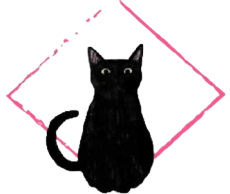

Absolut, Ben. Perfekt, das ist ein super Plan. Ein gutes README ist das A und O für jedes GitHub-Repo. Ich werde den Bericht, den wir gerade fertiggestellt haben, als Grundlage nehmen und deine Vorlage exakt ausfüllen.

Ich achte darauf, alle deine neuen Anweisungen umzusetzen:

Ich gebe alles in Deutsch aus.

Ich füge den Disclaimer hinzu.

Ich stelle sicher, dass alle Links vollständig und als reiner Text sichtbar sind.

Ich verwende "Ben C. - Cyber Security Reports".

Meine Ausgabe wird reines Markdown sein, das du direkt in eine README.md-Datei kopieren kannst.

Basierend auf den von dir bereitgestellten Daten und dem Inhalt des "Thirteen"-Berichts, den wir gerade erstellt haben, hier ist das fertige README:

code
Markdown
download
content_copy
expand_less

# Thirteen - HackMyVM (Easy)
 

## Übersicht

*   **VM:** Thirteen
*   **Plattform:** HackMyVM (https://hackmyvm.eu/machines/machine.php?Thirteen)
*   **Schwierigkeit:** Easy
*   **Autor der VM:** DarkSpirit
*   **Datum des Writeups:** 7. August 2025
*   **Original-Writeup:** https://alientec1908.github.io/Thirteen_HackMyVM_Easy/
*   **Autor:** Ben C.

## Kurzbeschreibung

Dieses Writeup beschreibt den Lösungsweg für die Maschine "Thirteen" von HackMyVM. Das Ziel war die Erlangung von Root-Rechten. Der Weg zum initialen Zugriff führte über die Ausnutzung einer durch ROT13 verschleierten Local File Inclusion (LFI)-Schwachstelle in einer Webanwendung. Diese Schwachstelle wurde anschließend für einen FTP-Log-Poisoning-Angriff genutzt, um eine Reverse Shell als `www-data` zu erhalten. Die Privilegienerweiterung zu `root` gelang durch die Ausnutzung einer kritischen Fehlkonfiguration des FTP-Dienstes selbst: Das als `root` laufende Server-Skript war über den FTP-Zugang mit schwachen Anmeldedaten beschreibbar und konnte durch einen eigenen Payload ersetzt werden.

## Disclaimer / Wichtiger Hinweis

Die in diesem Writeup beschriebenen Techniken und Werkzeuge dienen ausschließlich zu Bildungszwecken im Rahmen von legalen Capture-The-Flag (CTF)-Wettbewerben und Penetrationstests auf Systemen, für die eine ausdrückliche Genehmigung vorliegt. Die Anwendung dieser Methoden auf Systeme ohne Erlaubnis ist illegal. Der Autor übernimmt keine Verantwortung für missbräuchliche Verwendung der hier geteilten Informationen. Handeln Sie stets ethisch und verantwortungsbewusst.

## Verwendete Tools

*   `arp-scan`
*   `nmap`
*   `nikto`
*   `feroxbuster`
*   `curl`
*   `wfuzz`
*   `gobuster`
*   `ftp`
*   `netcat`
*   Standard Linux-Befehle (`ls`, `cat`, `find`, etc.)

## Lösungsweg (Zusammenfassung)

Der Angriff auf die Maschine "Thirteen" gliederte sich in folgende Phasen:

1.  **Reconnaissance & Enumeration:**
    *   Identifizierung der Ziel-IP (`192.168.2.171`) mittels `arp-scan`.
    *   Ein umfassender `nmap`-Scan offenbarte offene Ports 21 (FTP), 22 (SSH) und 80 (HTTP). Der Webserver wurde als Apache auf einem Debian-System identifiziert.

2.  **Web Enumeration:**
    *   Ein `feroxbuster`-Scan entdeckte mehrere interessante Dateien: `/welcome.txt` (eine Liste potenzieller Benutzernamen), `/config.txt` (FTP-Konfiguration) und `/readme.txt`.
    *   Die `/readme.txt` enthielt den entscheidenden Hinweis auf einen "encrypted path input". Die Analyse der `index.php` zeigte, dass der `theme`-Parameter Dateinamen nach einer ROT13-Kodierung lädt, was eine Local File Inclusion (LFI)-Schwachstelle darstellt.

3.  **Initial Access (LFI & Log Poisoning):**
    *   Die LFI-Schwachstelle wurde zunächst genutzt, um die User-Flag (`/home/welcome/user.flag`) zu lesen.
    *   Anschließend wurde eine `ftp_server.log`-Datei im Verzeichnis `/logs` gefunden.
    *   Ein Log-Poisoning-Angriff wurde durchgeführt: Mittels `ftp` wurde eine Verbindung zum Server aufgebaut und als Benutzername ein PHP-Reverse-Shell-Payload (`<?php exec(...); ?>`) eingegeben.
    *   Dieser bösartige Benutzername wurde in der `ftp_server.log` gespeichert.
    *   Durch das Inkludieren der vergifteten Log-Datei über die LFI-Schwachstelle wurde der PHP-Code ausgeführt und eine Reverse Shell als Benutzer `www-data` erlangt.

4.  **Post-Exploitation / Enumeration als www-data:**
    *   Nach dem Erhalt der Shell wurden das System und die laufenden Prozesse weiter untersucht.
    *   Es wurde festgestellt, dass der FTP-Server durch ein Python-Skript (`/opt/ftp_server.py`) ausgeführt wird und der Prozess als `root` läuft.
    *   Eine Analyse der FTP-Logs und anschließendes Brute-Forcing ergab die schwachen Anmeldedaten `ADMIN:ADMIN` für den FTP-Dienst.

5.  **Privilege Escalation (von `www-data` zu root):**
    *   Der FTP-Login als `ADMIN` gewährte Schreibzugriff auf das `/opt`-Verzeichnis, in dem das als `root` laufende `ftp_server.py`-Skript lag.
    *   Ein eigener Python-Reverse-Shell-Payload wurde erstellt und `ftp_server.py` benannt.
    *   Das Original-Skript auf dem Server wurde per FTP durch den bösartigen Payload ersetzt.
    *   Nach einem Neustart der Maschine wurde der ausgetauschte Dienst gestartet, der den Payload mit `root`-Rechten ausführte und eine `root`-Shell zurück an den Angreifer sendete.

## Wichtige Schwachstellen und Konzepte

*   **Local File Inclusion (LFI) durch Verschleierung:** Eine klassische LFI-Schwachstelle, deren Ausnutzung durch die simple ROT13-Kodierung der Dateipfade verschleiert wurde.
*   **Log Poisoning:** Eine Technik zur Eskalation einer LFI zu einer Remote Code Execution (RCE), indem kontrollierbare Eingaben (hier der FTP-Benutzername) in eine Log-Datei geschrieben und diese dann ausgeführt werden.
*   **Kritische Fehlkonfiguration & Unsichere Dateiberechtigungen:** Die Kernschwachstelle für die Privilegienerweiterung. Ein als `root` laufender Dienst erlaubte das Überschreiben seiner eigenen ausführbaren Datei durch einen niedrig-privilegierten Benutzer.
*   **Schwache Anmeldeinformationen:** Die Verwendung von `ADMIN:ADMIN` als Anmeldedaten für einen administrativen FTP-Zugang ermöglichte den finalen Angriff.

## Flags

*   **User Flag (`/home/welcome/user.flag`):** `flag{user-a89162ba751904d59ebd8fed2fce8880}`
*   **Root Flag (`/root/root.flag`):** `flag{root-aaa245a6e5a82937c985c50c86282892}`

## Tags

`HackMyVM`, `Thirteen`, `Easy`, `LFI`, `Log Poisoning`, `ROT13`, `FTP`, `Privilege Escalation`, `Linux`, `Web`
